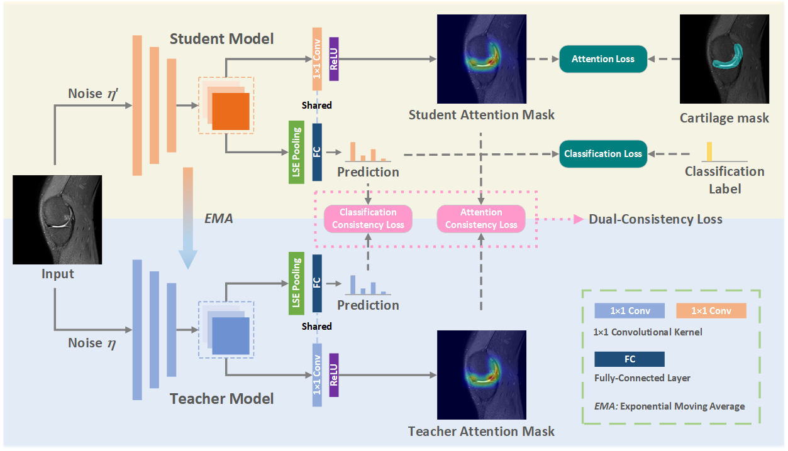
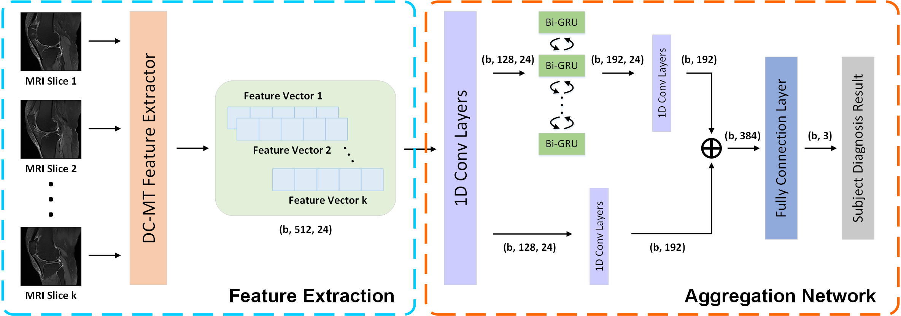

# Automatic Grading Assessments for Knee MRI Cartilage Defects via Self-ensembling Semi-supervised Learning with Dual-Consistency

This is the official PyTorch implementation for the DC-MT method to handle automatic knee cartilage defect assessment based on T2-weighted MRI.

**Automatic Grading Assessments for Knee MRI Cartilage Defects via Self-ensembling Semi-supervised Learning with Dual-Consistency**<br>
by **Jiayu Huo**, Xi Ouyang, Liping Si, Kai Xuan, Sheng Wang, Weiwu Yao, Ying Liu, Jia Xu, Dahong Qian, Zhong Xue, Qian Wang, Dinggang Shen, Lichi Zhang<br>

## Abstract
We propose a semi-supervised framework to effectively use unlabeled data for better evaluation of knee cartilage defect assessment. The framework contains two separate models ([DC-MT model](DC-MT/README.md) and [Aggregation model](Aggregation-Network/README.md)). Experimental results show that our proposed method can significantly improve both classification and localization performances of knee cartilage defects.

### DC-MT Network


### Aggregation Network



## Installation
Clone this repo.
```bash
git clone https://github.com/King-HAW/DC-MT.git
cd DC-MT/
```
This code requires PyTorch 1.1+ and python 3+. Please install Pytorch 1.1+ environment, and install dependencies (e.g., visdom and h5py) by
```bash
pip install -r requirements.txt
```

For the usage of DC-MT network and aggregation network, please go to [DC-MT](DC-MT/README.md) and [Aggregation](Aggregation-Network/README.md) for the detailed information.

## Acknowledgments
- This code repository refers to [HAM](https://github.com/oyxhust/HAM), [MT](https://github.com/CuriousAI/mean-teacher), and [RSNA Intracranial Hemorrhage Detection](https://github.com/SeuTao/RSNA2019_Intracranial-Hemorrhage-Detection)

- We thank Xi Ouyang, Tao Shen, and Antti Tarvainen for their awesome and efficient code bases.